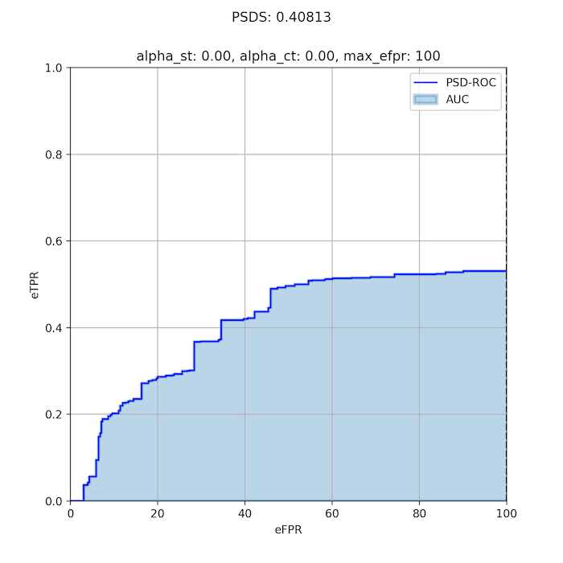

# Polyphonic Sound Detection Score (PSDS)

`psds_eval` is a python package which contains a library that can be used to
 calculate the Polyphonic Sound Detection Score as it is presented in:

> **A Framework for the Robust Evaluation of Sound Event Detection**  
C. Bilen, G. Ferroni, F. Tuveri, J. Azcarreta, S. Krstulovic  
https://arxiv.org/abs/1910.08440

## Installation
In order to install the `psds_eval` package:
1. Clone the repository `git clone https://github.com/audioanalytic/psds_eval.git`
2. `cd psds_eval`
3. `pip install -e .`

## Running the tests
The tests can be run using pytest like so:
> `pytest tests`

## Code Example
Provided with the `psds_eval` library is a code example that shows how the library can be used
to produce the PSDS of a system against a dataset.

The dataset used in the example, which can be found in the `examples/data` folder, is the validation subset from the
[DCASE-2019 Task 4](http://dcase.community/challenge2018/task-large-scale-weakly-labeled-semi-supervised-sound-event-detection#audio-dataset)
challenge.

So that the operating point of the system under evaluation can be changed, the baseline system provided in
[Task 4](http://dcase.community/challenge2018/task-large-scale-weakly-labeled-semi-supervised-sound-event-detection#baseline-system)
has been adjusted to accept a threshold value and to apply it on the
system's output scores. This results in different sets of detections for
each threshold value.
These sets of detections have been saved in the data folder using the following naming convention:  
`baseline_<TH>.csv`, where TH = 0.1, 0.2, ..., 1.0

Once the `psds_eval` package is installed you may run the evaluation example using the
python script from the examples folder like so:
```
$ python examples/run_psds.py
```
Running this should result in the PSD-Score value of **0.40813** and the plot below.



## FAQ
Although the theoretical background is rigorously described in the
paper, in this section we address some important details from a practical
perspective

### What are all the input variables for?
One of the design principle behind `psds_eval` is *flexibility*.
In practice, the PSDS evaluation adapts to any task constraints by
configuring the following three percentages (cf. Fig.2a article):

1. **Detection Tolerance Criterion threshold** (cf. Definition 2 article)
    * Controls how precise a system detection has to be with respect to all the
    ground truths of the same class that it intersects.

2. **Ground Truth intersection Criterion threshold** (cf. Definition 3 article)
    * Defines the amount of minimum overlap necessary to count a ground truth
    correctly detected.

3. **Cross-Trigger Tolerance Criterion threshold** (cf. Definition 4 article)
    * Same as GTC, but applied to the system detections that intersect ground
    truths of other classes of interest for detection, as distinct from false
    alarms which don’t intersect with any other label.

Moreover, the calculation of the PSDS of a system can be configured to take into
account several constraints:

- The importance of **cross-triggers** can be specified in the effective False
Positive Rate definition by the parameter `alpha_ct` (cf. Equation 6 article)

- How important the **inter-class variability** is controlled in the definition of
the effective True Positive Ratio by the parameter `alpha_st` (cf. Equation 9 article)

- The maximum effective False Positive Rate at which the area under the PSD-ROC is
computed can be adjusted by the parameter `max_efpr`. This value is crucial because
defines an upper bound for the mistakes a system can make in a unit of time.


**Important notes:**
- More than one detection can contribute to a single true positive (TP)
- Detections contributing to TPs are not considered for cross-trigger (CT) counts

### Why are multiple operating points required?
We want to evaluate a system across a range of operating points in contrast with
more classic metrics (such as F-Score or Accuracy). Such approach provides
an evaluation which is more generic and independent from the system's tuning.

### What is the minimum number of operating points required?
It depends on how the system behaves. We encourage the user to start with at
least 20 operating points and, based on how the PSD-ROC looks, more operating
points can be added to represent the system behavior as accurately as possible.

### What are the input requirements?
All the inputs must be a `pandas.DataFrame`. There are two table
formats:

#### 1. `detections` and `ground_truth` tables format
Column names are the same as those used in the DCASE evaluation.
Each row is defined by 4 values: `filename`, identifies the input audio file,
`onset` and `offset` are the *start* and *end* time (expressed in seconds) of
the event, and `event_label` is the name of the class the event belongs to.
```
# example of ground truth table
filename   onset  offset  event_label
test.wav     2.0    20.0           c1
test.wav    12.0    35.0           c2
test.wav    42.0    47.0           c3
test2.wav    5.0    20.0           c1
test2.wav    5.0    30.0           c2
test2.wav   42.0    47.0           c3
test3.wav    5.0    18.0           c1
test3.wav   10.0    30.0           c2
test3.wav   42.0    48.0           c3

# example of detections table
filename   onset  offset  event_label
test.wav     0.0    19.0           c1
test.wav    40.0    45.0           c1
test.wav    11.0    25.0           c2
test.wav    27.0    30.0           c2
test.wav    32.0    41.5           c2
test.wav    38.0    48.0           c3
```

#### 2. `metadata` table format
Simply contains the duration (in seconds) for each file in the dataset:
```
filename  duration
test.wav      50.0
test2.wav     50.0
test3.wav     50.0
```

**Important notes**
- `metadata` and `ground_truth` tables must have the same unique values in the
"filename" column

## License
psds\_eval is MIT licensed, as found in the [LICENSE](LICENSE) file.
